<div align="center">
  

# 數字加減（Number Math）

給小朋友的可愛動物加減法遊戲，
讓孩子用「看得到、點得到、聽得到」的方式學習數字。

**版本：v1.0.2** ｜ **平台：Android 12+（API 31+）** ｜ **授權：MIT**

</div>

---

## 這是什麼 App？

`數字加減` 是一個給孩子和家長一起玩的數學小遊戲：

- 小朋友看著可愛動物做 **加法 / 減法**
- 點動物就能一邊玩、一邊數
- 有語音朗讀，幫助孩子跟著唸數字

---

## 三種遊戲模式

- **加法**：點左右兩區動物，數出總共幾隻
- **減法**：點左邊動物畫 X，觀察減掉幾隻
- **混合**：每題隨機出加法或減法

---

## 小朋友怎麼玩？（超簡單）

1. 在主畫面選一個模式（加法 / 減法 / 混合）
2. 看動物、點動物
3. 按下面你覺得正確的數字
4. 看看自己答對幾題、拿到多少分

---

## 給家長看的重點

- 支援 **中文 / English / 日本語**
- 可調整：題數、最大數量、語音模式、語言
- 排行榜可用動物 emoji 存名字，孩子會很有參與感
- 本機儲存（DataStore），不需要帳號

### v1.0.2 更新重點

- GitHub Releases 改為使用正式 `assembleRelease` 產出的 release APK。
- Release APK 使用私密 release keystore 簽章，不再使用 Android Debug certificate。
- 已安裝舊版 debug-signed APK 的裝置，第一次改裝 release-signed APK 時可能需要先解除安裝舊版。

### v1.0.1 更新重點

- 修正測試、設定、語言、結果等非主畫面在直式/橫式切換時會跳回主畫面的問題。
- 測試中旋轉螢幕後會保留目前題目進度與退出確認對話框狀態。
- 結果畫面旋轉後會保留正在輸入的表情名字與分數儲存狀態。

---

## 畫面預覽

### 主畫面與模式

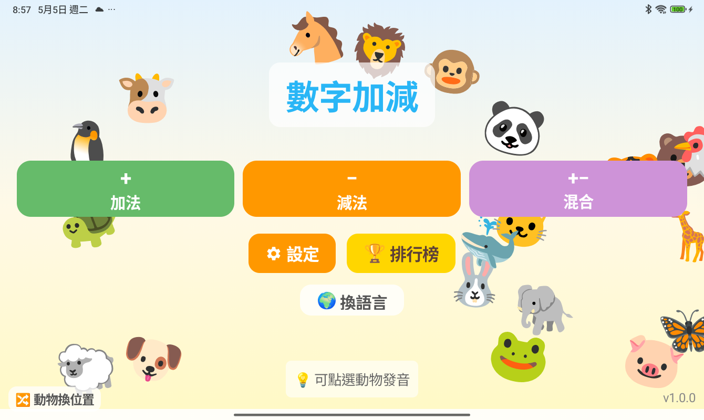

### 加法操作

| 題目畫面 | 點擊計數 |
|---|---|
| 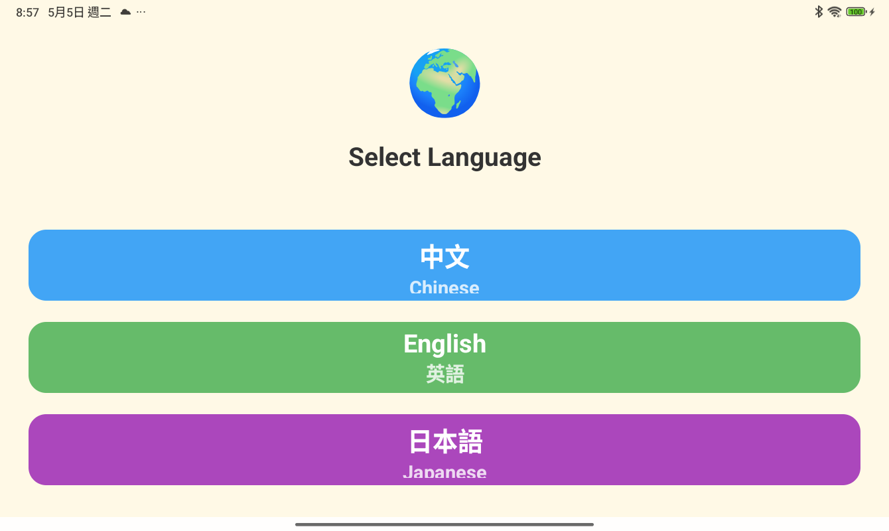 | 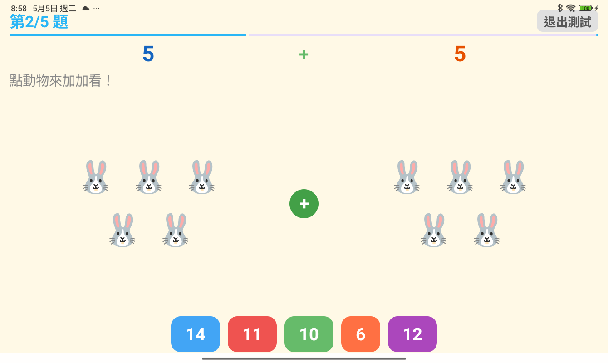 |

### 減法操作

| 題目畫面 | 畫 X 減去 |
|---|---|
| 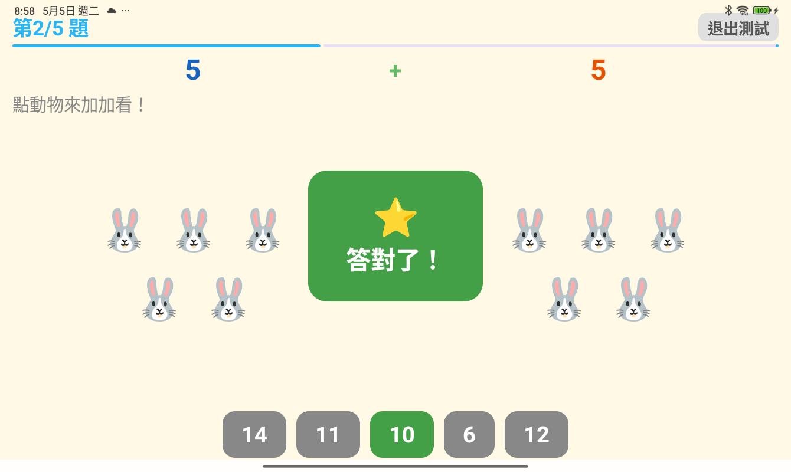 | 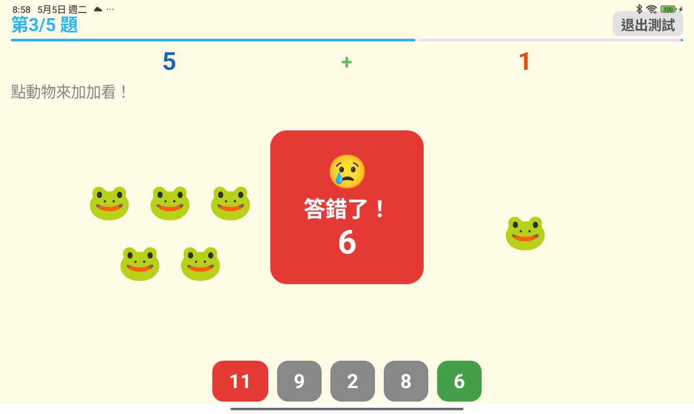 |

### 答題與結果

| 答題回饋 | 成績與排行榜 |
|---|---|
| 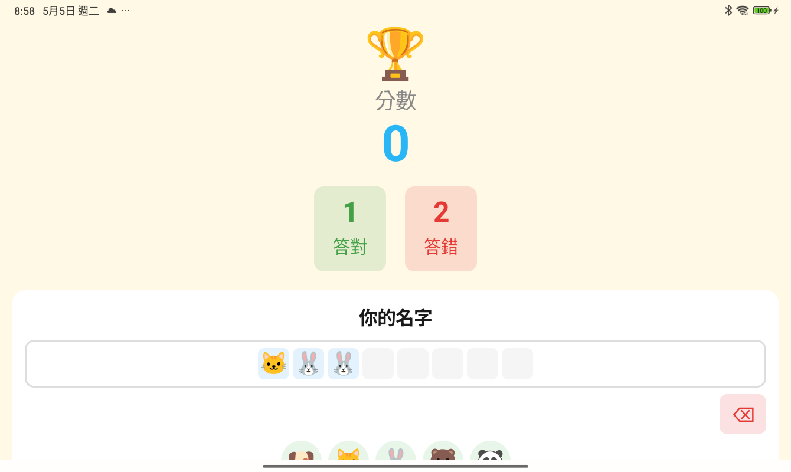 | 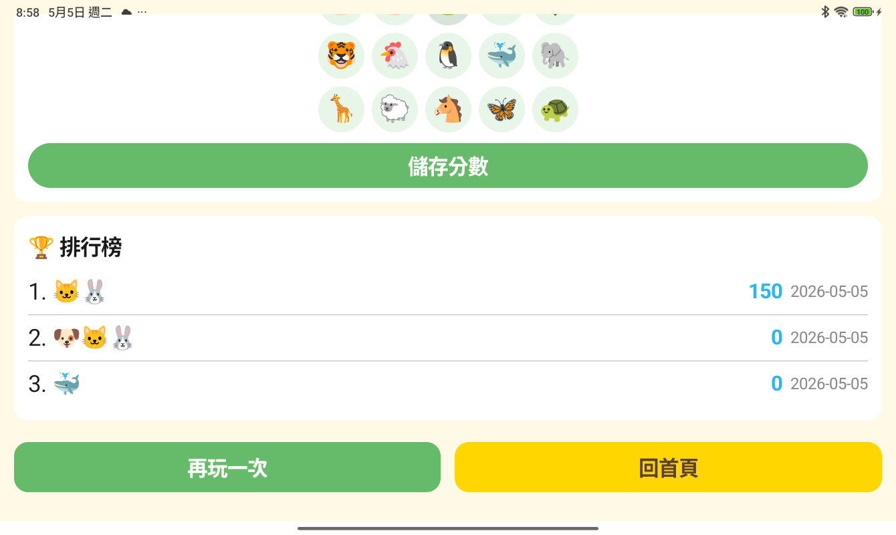 |

### 設定畫面

| 設定上半部 | 設定下半部 |
|---|---|
| 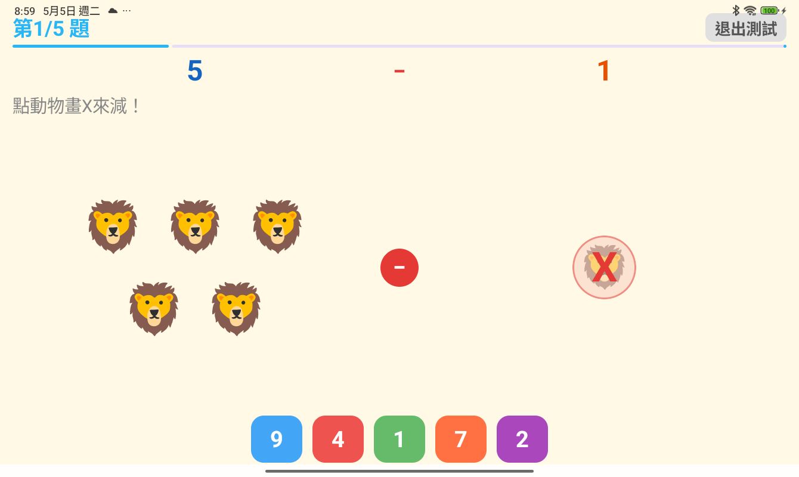 | 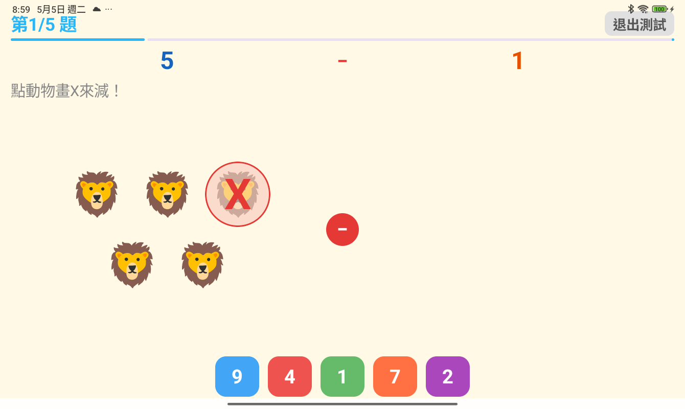 |

### 語言與其他畫面

| 畫面 1 | 畫面 2 |
|---|---|
| 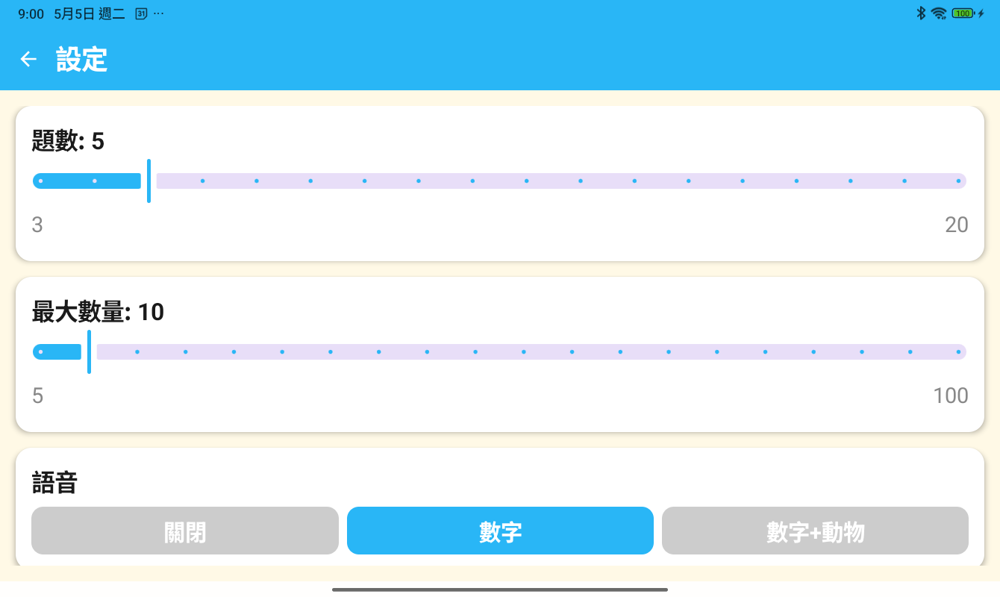 | 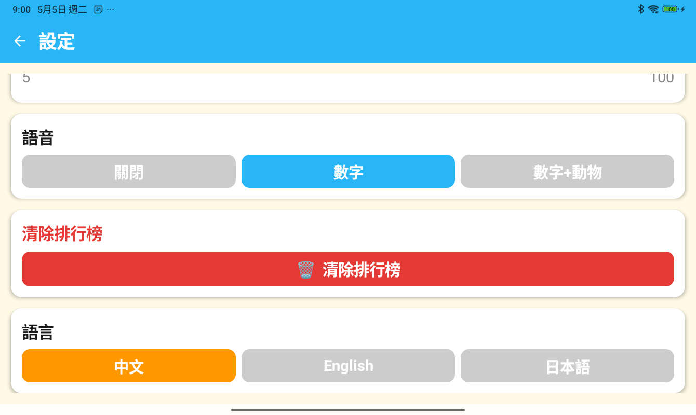 |

---

## 安裝 / 建置

### 直接安裝（給家長）

1. 到專案的 Releases 下載 APK
2. 在 Android 手機上安裝

### 從原始碼建置

```bash
./gradlew assembleRelease
```

APK 輸出位置：

`app/build/outputs/apk/release/app-release.apk`

> Release build 需要本機私密 `keystore.properties` 或對應環境變數；金鑰與密碼不可提交到 GitHub。

---

## 技術資訊

- 語言：Kotlin
- UI：Jetpack Compose + Material 3
- 語音：Android TextToSpeech
- 儲存：DataStore Preferences
- 最低支援：Android 12（API 31）

---

## 授權

本專案使用 **MIT License**，詳見 `LICENSE`。
